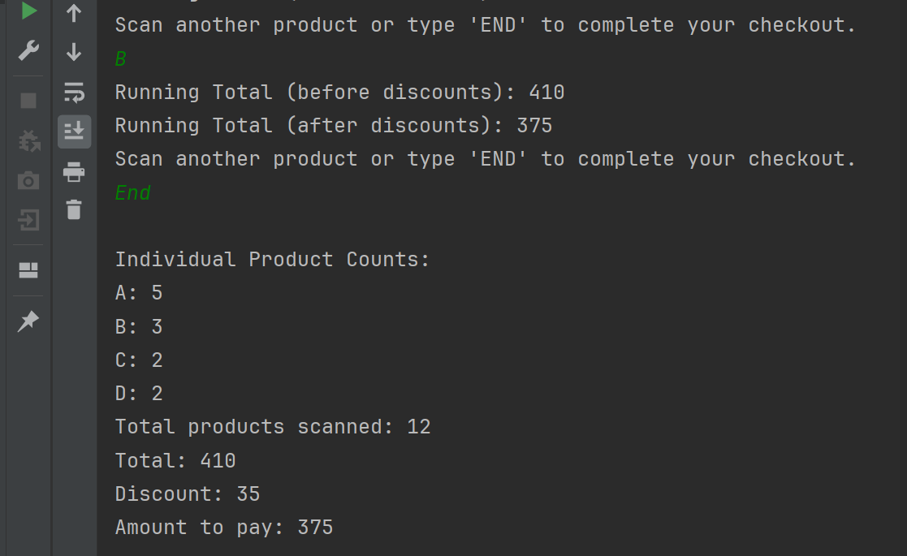

# **Supermarket Checkout System**

This project implements a supermarket checkout system that calculates the total price of items using dynamic pricing rules. Items are identified using Stock Keeping Units (SKUs), and the system provides a running total after each scanned item, with a final total calculation. It supports customizable pricing rules, making it adaptable for frequently changing offers.

---

## **Features**
- SKU-based item identification (A, B, C, D).
- Dynamic pricing rules with special offers:
  - A: 50 pence each or 3 for 130 pence.
  - B: 30 pence each or 2 for 45 pence.
  - C: 20 pence each.
  - D: 15 pence each.
- Running total after every scanned item.
- Final total calculation upon command.
- Command-line interface for scanning items.

---

## **Prerequisites**
- **Java**: Version 21
- **Maven**: Version 3.6.3 or later

---

## **How to Clone and Run the Project**

### **Clone the Repository**
1. Open a terminal/command prompt.
2. Clone the repository:
   ```bash
   git clone https://github.com/waqaxyaseen/Supermarket-Checkout-System.git
   ```
###  **Run the Application**
Run the application with Maven:
 ```bash
mvn exec:java -Dexec.mainClass="SupermarketCheckoutSystem"
```
### **Input Items**
1. Enter SKUs A, B, C or D (capital only) one at a time.
2. Type End/end to calculate and display the final total price.

### **Output**


